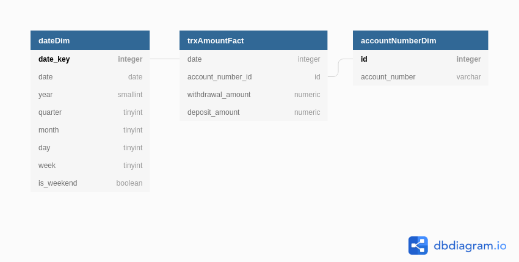
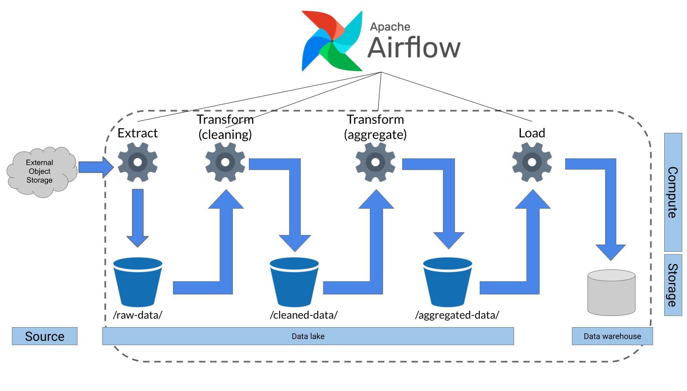

# Simple Data Pipeline

## Purpose

This is a mini application to demonstrate end to end-to-end data pipeline using Airflow. Because of the purpose, some parts are over engineered.

## Business Question Asked

This data processing and analysis is meant to answer a single business question:

> What is the average amount of money that is withdrawed and deposited by all Account in March 2018?

## Schema

To answer the above business question, few Facts and Dimensions are considered:

1. Dimension `date`
2. Dimension `account_number`
3. Fact `withdrawal_amount`
4. Fact `deposit_amount`

This lead to a Star schema in Data Warehouse:



## Architecture

A Data Pipeline is established to perform ETL jobs resulting in Data Warehouse loaded with processed data extracted from the source.

The architecture of data pipeline illustrated in image below:



Explanation:

1. **Source:** It is assumed that OLTP system will provide downloadable transaction data in XLXS format. The data is provided at external object storage that complied with S3 protocol. In tihs case Minio is used as object storage
1. **Extract:** Data pipeline will extract XLSX file from the source. It is considered as best practice to directly store extracted data as raw as posible in Data Lake, so the extracted data is stored in `raw-data` bucket in the Data Lake. In this case, an internal object storage Minio is used as a Data Lake
1. **Transform:** Data will be transformed in 2 steps:
   * ***Clean**:* data is cleaned, in this case, by removing `'` character at the end of Account Number values. Also, every date format is converted to ISO 8601 format.
   * ***Aggregate***: data is aggregated by summarizing Withdrawal Ammount and Deposit Ammount per Account Number per day

   It is considered as best practice to store the resulting data of each transformation step to improve scalability and repeatability. So the resulting data is stored in Data Lake implemented using Minio. The resulting data is stored in Parquete format.

1. **Load:** Finally the data is loaded to Data Warehouse implemented using MySQL database.

1. **Airflow:** Apache Airflow is used as workflow ocrchestrator.

## Technical Decision

1. Data storage
   Object storage Minio is used for Data Lake because it is scalable and portable. Besides, it's S3 standard so we can change the stack easily without changing code.

   MySQL is used for Data Warehouse because it is a simple relational database to implement.

2. Frameworks & Libraries
   Apache Airflow is used for workflow orchestration so we can implement best practices in ETL easily, such as scheduling, keeping idempotency,  and failure handling.

   Pandas is used for data manipulation because it is a simple library to use as long as the data size is fit in memory.

3. Database schema
   The database schema is using Star Schema to optimize for analytics.

## Insights defined from resulting datasets

To answer this question

> What is the average amount of money that is withdrawed and deposited by all Account in March 2018?

a simple query can be executed against Data Warehouse, such as

```sql
SELECT MIN(dimDate.`date`), MAX(dimDate.`date`), AVG(withdrawal_amount), AVG(deposit_amount)
FROM trxAmountFact
LEFT JOIN dimDate ON dimDate.date_key = trxAmountFact.`date`
WHERE dimDate.`month`=3 AND dimDate.`year`=2018
```

and it will return

```txt
MIN(dimDate.`date`)|MAX(dimDate.`date`)|AVG(withdrawal_amount)|AVG(deposit_amount)|
-------------------|-------------------|----------------------|-------------------|
         2018-03-01|         2018-03-31|       16142038.312108|    15997135.179880|
```

## How to Run

1) Prerequisite
   * Docker installed
   * Docker Compose installed

1) Configure `.env`

   ```sh
   nano .env
   ```

1) Build and run Docker container

   ```sh
   docker-compose up -d
   ```

1) Access Airflow UI on <http://localhost:8080>

### Local Development Setup

For local development purpose, you can setup local Airflow with other dependencies installed in your machine by following these steps:

1. Set Airflow Home Directory

   ```sh
   cd airflow-pipeline/
   export AIRFLOW_HOME=$PWD
   ```

1. Set `FERNET_KEY`

   ```sh
   export FERNET_KEY=Zp3FDPCdBoq03Begm2RJOL_3obEwrleTdkS02UNgV48=
   ```

1. Change `airflow.cfg`

   For local develpoment, it's enough to use SequentialExecutor, so change corresponding line to be:

   ```txt
   ...
   executor = SequentialExecutor
   ...
   sql_alchemy_conn = sqlite:///$AIRFLOW_HOME/airflow.db
   ...
   ```

1. Setup and activate virtual environment

   ```sh
   virtualenv --no-site-packages venv
   source venv/bin/activate
   ```

1. Set Airflow Variables

   ```sh
   airflow variables --set SOURCE_MINIO_ENDPOINT localhost:9001
   airflow variables --set SOURCE_MINIO_ACCESS_KEY minio
   airflow variables --set SOURCE_MINIO_SECRET_KEY minio123
   airflow variables --set SOURCE_MINIO_BUCKET source-bucket

   airflow variables --set DATALAKE_MINIO_ENDPOINT localhost:9002
   airflow variables --set DATALAKE_MINIO_ACCESS_KEY minio
   airflow variables --set DATALAKE_MINIO_SECRET_KEY minio123
   airflow variables --set DATALAKE_MINIO_RAW_BUCKET raw-data
   airflow variables --set DATALAKE_MINIO_CLEANED_BUCKET cleaned-data
   airflow variables --set DATALAKE_MINIO_AGG_BUCKET agg-data
   ```

1. Install Airflow and Python dependencies

   ```sh
   sudo apt install libpq-dev python-dev
   pip install -r dags/requirements.txt
   ```

1. Initialize Airflow database

   ```sh
   airflow initdb
   ```

1. Validate Airflow installation

   ```sh
   airflow version
   ```

1. Run Airflow scheduler and webserver

   ```sh
   airflow scheduler -D
   airflow webserver -D
   ```
